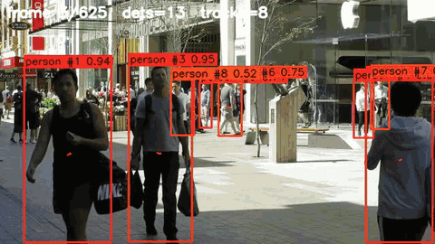

<div align="center">
<h2>motrack</h2>

<p><b>纯 C++11 多目标跟踪 — ByteTrack / Sort / OC-Sort / DeepSort / JDE 统一框架。零外部下载，可嵌入，可交叉编译。</b></p>

<p align="center">
  
</p>

<p>
  <i>YOLO26 + motrack 在示例视频上的效果 — ID 稳定，带运动轨迹。</i>
</p>

<p>
  <a href="#编译"></a>
  <a href="#交叉编译"></a>
  <a href="README.md"></a>
</p>
</div>

此仓库提供了 C++ 多目标跟踪库 motrack，内置可插拔的关联算法 —— ByteTrack、Sort、
OC-Sort、DeepSORT 以及 JDE 风格的联合嵌入跟踪 —— 并附带 Python 绑定，且便于跨平台编译。

**亮点**

- 🧩 **单头文件公开 API**（`Motrack.h`）— 统一的 `Tracker` 门面，pimpl 隐藏内部实现，Eigen 不会泄漏到使用方的构建中。
- 🔀 **算法可插拔** — `TrackerType::ByteTrack / Sort / OCSort / DeepSort / JDE`；纯运动学与外观关联两族算法分目录放置在 `src/algos/`（设计文档见 `docs/`）。
- 🪶 **仅 C++11** — Eigen 3.3.9 随仓库内置，configure 阶段不拉取任何外部资源，交叉编译完全封闭。
- 🐍 **可选 Python 绑定** — 正常的 CMake 构建即可产出 pip 可安装的 wheel（`pymotrack`）。
- 🎯 **自带 YOLO 演示** — `test/demo_yolo.py` 支持视频/图片目录/摄像头输入，输出标注 MP4 和 MOT 结果。

### 编译
要编译该项目，请按照以下步骤操作：
```bash
mkdir build && cd build && cmake ..
make -j4 install
```
如果需要构建Python库，请使用`-DWITH_PYTHON=true`选项。

### 交叉编译
如对于rv1106的编译，请使用：
```bash
cmake -DCMAKE_TOOLCHAIN_FILE=../toolchain/rv1106.toolchain.cmake ..
```

### 依赖项
无需单独下载；依赖项已嵌入项目中：
- Eigen 3.3.9
- pybind11-2.10.4（可选）

### 示例用法
```cpp
#include "Motrack.h"
#include <iostream>
int main(int argc, char* argv[])
{
    motrack::Tracker tracker(motrack::TrackerType::ByteTrack);
    for (int i = 0; i < 20; i++)
    {
        std::vector<motrack::Object> objects;
        objects.push_back({0.9, 0, {100+i*10, 100, 50, 50}});
        std::vector<motrack::Track> tracks = tracker.update(objects);
    }
    return 0;
}
```

一个参数即可切换算法：

```cpp
motrack::TrackerConfig config;          // 所有算法共用
config.max_age = 30;
motrack::Tracker deep(motrack::TrackerType::DeepSort, config);  // 基于 Re-ID
```

### Python wheel 包

启用 `-DWITH_PYTHON=true` 后，构建过程会额外在 `build/dist/` 下产出一个可通过
pip 直接安装的 wheel：

```bash
mkdir build && cd build
cmake -DWITH_PYTHON=true ..
make -j4                                              # 同时生成 .so 与 wheel
pip install dist/pymotrack-*.whl                      # 安装为 `pymotrack`
```

生成的 wheel 会带上当前 Python / 平台 tag（例如
`pymotrack-1.0.0-cp310-cp310-linux_x86_64.whl`），并以包的形式重新导出与
in-tree `.so` 完全相同的 API：

```python
import pymotrack as mt

tracker = mt.Tracker(mt.TrackerType.ByteTrack, mt.TrackerConfig(max_age=30))
tracks = tracker.update([
    mt.Object(prob=0.9, label=0, rect=mt.Rect(100, 100, 50, 50)),
])
```

如需自定义版本号，在 configure 阶段传入 `-DMOTRACK_WHEEL_VERSION=x.y.z`。

### YOLO + 跟踪示例（`test/demo_yolo.py`）

`test/demo_yolo.py` 使用现成的 YOLO 检测器出框，将结果送入
`pymotrack`，并把 ID 与轨迹绘制到输出 MP4。支持三种输入源：视
频文件、逐帧图片目录、以及摄像头设备号。

`assets/demo.mp4` 是仓库自带的一小段样例视频，用于快速跑通脚本。YOLO 权重
**不随仓库分发**，请自行按需下载任意 `ultralytics` 兼容的权重，例如：

```bash
# ultralytics 首次使用时会自动下载：
python -c "from ultralytics import YOLO; YOLO('yolo11s.pt')"
# 或者手动拉取：
wget https://github.com/ultralytics/assets/releases/download/v8.2.0/yolo11s.pt
```

依赖：先按上一节完成 Python 模块的构建，然后安装
`pip install ultralytics opencv-python`（或者直接安装上面产出的 wheel）。运行
时需要在 `test/` 目录里执行，脚本会通过 `../build` 加载刚编出来的 `.so`：

```bash
cd test
python demo_yolo.py \
    --source  ../assets/demo.mp4 \
    --weights yolo11s.pt \
    --out     ./output/demo.mp4
```

常用参数（完整列表见 `demo_yolo.py --help`）：

- `--classes 0 2 5` —— 要保留的 COCO 类别 id（默认 `0` = person；留空表示全部）。
- `--conf 0.25` / `--nms_iou 0.7` / `--imgsz 640` —— YOLO 的置信度 / NMS / 输入尺寸。
- `--track_thresh` / `--high_thresh` / `--match_thresh` / `--max_age` —— 原样
  透传给跟踪器，默认值与 C++ 侧一致。
- `--results out.txt` —— 额外输出 MOT 格式的结果文件。
- `--show` —— 同时打开一个 cv2 实时窗口（按 `q` / `Esc` 退出）。

### 参考：
- [ByteTrack](https://github.com/ifzhang/ByteTrack)
- [ByteTrack-cpp](https://github.com/Vertical-Beach/ByteTrack-cpp)

### 引用
```bibtex
@article{zhang2022bytetrack,
  title={ByteTrack: Multi-Object Tracking by Associating Every Detection Box},
  author={Zhang, Yifu and Sun, Peize and Jiang, Yi and Yu, Dongdong and Weng, Fucheng and Yuan, Zehuan and Luo, Ping and Liu, Wenyu and Wang, Xinggang},
  booktitle={Proceedings of the European Conference on Computer Vision (ECCV)},
  year={2022}
}
```
