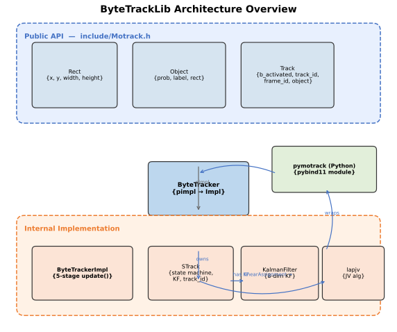
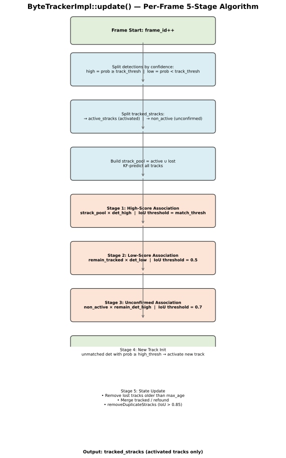
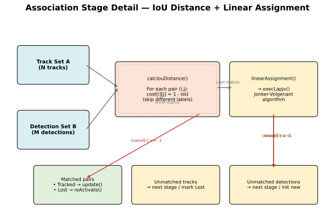
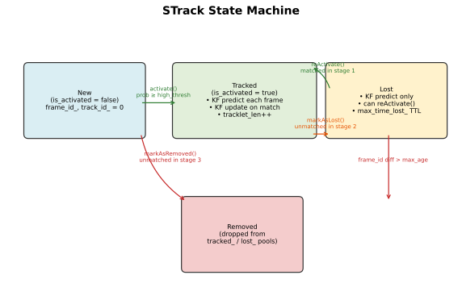
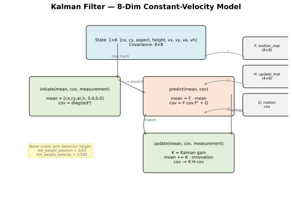
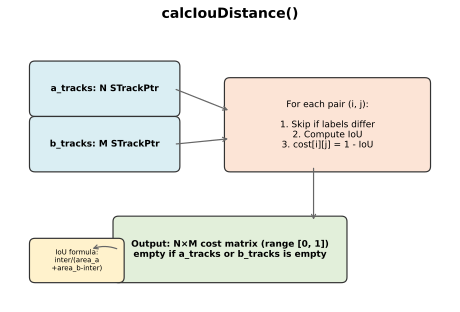
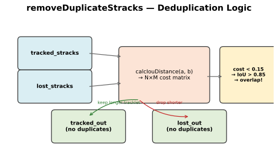

# motrack 架构与算法文档

> 本文档详细分析 motrack 的代码架构、核心算法流程、状态机及数据流。
> 版本：基于 commit `e1ebfbc` 的 C++11 实现，支持 Python 绑定。

---

## 目录

1. [项目概述](#1-项目概述)
2. [整体架构](#2-整体架构)
3. [数据结构](#3-数据结构)
4. [ByteTrack 算法流程](#4-byteTrack-算法流程)
5. [STrack 状态机](#5-strack-状态机)
6. [卡尔曼滤波器](#6-卡尔曼滤波器)
7. [线性分配 (Jonker-Volgenant)](#7-线性分配-jonker-volgenant)
8. [IoU 距离计算](#8-iou-距离计算)
9. [去重策略](#9-去重策略)
10. [Python 绑定](#10-python-绑定)
11. [构建与交叉编译](#11-构建与交叉编译)
12. [参数调优指南](#12-参数调优指南)

---

## 1. 项目概述

motrack 是 [ByteTrack](https://github.com/ifzhang/ByteTrack) 多目标跟踪算法的 **C++11 重新实现**，核心思想是 **"关联每一个检测框"**——将高置信度检测框与低置信度检测框分开处理，分两阶段进行关联，最大程度地利用所有检测信息，减少漏检和 ID Switch。

### 核心特性

| 特性 | 说明 |
|------|------|
| 语言 | C++11，无异常（STL 抛出除外），`-Wall -O2` |
| 依赖 | Eigen 3.3.9（已内嵌为 zip） |
| Python 绑定 | pybind11 2.10.4（可选，已内嵌为 zip） |
| 目标平台 | Linux x86_64 / ARM Rockchip rv1106 |
| 设计约束 | 可嵌入、可交叉编译、无外部网络拉取 |
| 权限 | 公有 API 仅一个头文件，实现细节完全隐藏 (pimpl) |

---

## 2. 整体架构



motrack 采用 **PIMPL（Pointer to Implementation）** 设计模式，将公有 API 与内部实现完全隔离。

### 模块职责

| 模块 | 文件 | 职责 |
|------|------|------|
| **ByteTracker** | （已移除） | 兼容门面已随 motrack 更名删除；新代码使用 `include/Motrack.h` 的统一 `Tracker` |
| **ByteTrackerImpl** | `src/ByteTrackerImpl.cpp` | 核心算法：5 阶段每帧更新逻辑 |
| **STrack** | `src/STrack.cpp` | 单条轨迹状态机：New → Tracked → Lost → Removed |
| **KalmanFilter** | `src/KalmanFilter.cpp` | 8 维匀速卡尔曼滤波器 |
| **lapjv** | `src/lapjv.cpp` | Jonker-Volgenant 线性分配算法 |
| **pymotrack** | `src/python/pymotrack.cpp` | pybind11 模块，暴露 Python 接口 |

### 设计原则

- **PIMPL 模式**：`ByteTracker` 持有 `shared_ptr<ByteTrackerImpl>`，消费者永远看不到 `STrack`、`KalmanFilter` 或 Eigen 类型
- **窄接口**：公有 API 仅暴露 `ByteTracker::update()` 一个方法
- **内建依赖**：Eigen 和 pybind11 均以 zip 形式存放于 `3rd/`，CMake 配置时解压，无需外部网络

---

## 3. 数据结构

### 3.1 Rect (矩形框)

```cpp
struct Rect {
    float x{}, y{}, width{}, height{};  // 左上角坐标 + 宽高
};
```

### 3.2 Object (检测结果)

```cpp
struct Object {
    float prob{};           // 置信度 [0, 1]
    unsigned int label{};   // 类别标签 (COCO ID)
    Rect rect{};            // 边界框
};
```

### 3.3 Track (输出轨迹)

```cpp
struct Track {
    bool b_activated{};                    // 是否激活（已确认的轨迹）
    unsigned long long track_id{};         // 全局唯一轨迹 ID
    unsigned long long frame_id{};         // 当前帧号
    Object object{};                       // 关联后的检测框
};
```

### 数据结构关系

```
ByteTracker                    (门面类)
  └── shared_ptr<ByteTrackerImpl>   (PIMPL 指针)
        ├── tracked_stracks_    (当前活跃+已确认轨迹)
        ├── lost_stracks_      (丢失但未超时的轨迹)
        ├── frame_id_          (当前帧计数器)
        └── track_id_count_    (全局轨迹 ID 计数器)

STrack                         (单条轨迹)
  ├── kalman_filter_           (有自己的卡尔曼滤波器实例)
  ├── mean_ (1×8)              (KF 状态均值)
  ├── covariance_ (8×8)        (KF 状态协方差)
  ├── object_                  (最后关联的检测框)
  ├── state_                   (New/Tracked/Lost/Removed)
  ├── track_id_ / frame_id_ / start_frame_id_
  └── tracklet_len_            (轨迹存活帧数)
```

---

## 4. ByteTrack 算法流程

### 4.1 整体流程



每一帧调用 `ByteTracker::update(objects)` 时，经过 **5 个阶段** 完成跟踪更新：

### 4.2 详细阶段说明


#### 阶段 0：准备

```cpp
frame_id_++;  // 帧计数器递增

// 将当前帧检测框按置信度分成两组
for (const auto &object : objects) {
    if (object.prob >= track_thresh_)
        det_stracks.push_back(strack);      // 高置信度检测
    else
        det_low_stracks.push_back(strack);  // 低置信度检测
}

// 将已有轨迹分成激活/未激活两组
for (const auto& tracked_strack : tracked_stracks_) {
    if (!tracked_strack->isActivated())
        non_active_stracks.push_back(...);  // 未激活（仅出现一帧）
    else
        active_stracks.push_back(...);      // 已激活
}

// 构建关联池 = 激活轨迹 ∪ 丢失轨迹
strack_pool = active_stracks + lost_stracks_;

// 所有轨迹执行 KF 预测
for (auto &strack : strack_pool)
    strack->predict();
```

#### 阶段 1：高置信度关联

| 参数 | 值 |
|------|-----|
| 左集 (A) | `strack_pool` (激活轨迹 + 丢失轨迹) |
| 右集 (B) | `det_stracks` (高置信度检测) |
| 代价矩阵 | 1 - IoU (不同 label 的代价为 1.0) |
| 匹配阈值 | `match_thresh_` (默认 0.8) |

- 匹配上的 Tracked 轨迹 → `update()` (KF 更新)
- 匹配上的 Lost 轨迹 → `reActivate()` (重新激活)
- 未匹配的 Tracked 轨迹 → 进入**阶段 2**
- 未匹配的高置信度检测 → 进入**阶段 3**

#### 阶段 2：低置信度关联

| 参数 | 值 |
|------|-----|
| 左集 (A) | `remain_tracked_stracks` (阶段 1 未匹配的 Tracked) |
| 右集 (B) | `det_low_stracks` (低置信度检测) |
| 匹配阈值 | **0.5** (固定值) |

- 匹配上 → `update()` / `reActivate()`
- 未匹配 → `markAsLost()` → 加入 `current_lost_stracks`

#### 阶段 3：未确认轨迹关联

| 参数 | 值 |
|------|-----|
| 左集 (A) | `non_active_stracks` (未激活轨迹) |
| 右集 (B) | `remain_det_stracks` (阶段 1 未匹配的高置信度检测) |
| 匹配阈值 | **0.7** (固定值) |

- 匹配上 → `update()` (轨迹变为 Tracked)
- 未匹配的未激活轨迹 → `markAsRemoved()` (丢弃)
- 未匹配的检测且 `prob >= high_thresh_` → `activate()` **创建新轨迹**

#### 阶段 4：新轨迹初始化

```cpp
// 只有置信度 >= high_thresh (默认 0.6) 的检测才能创建新轨迹
if (track->getObject().prob < high_thresh_)
    continue;  // 太弱，跳过

track_id_count_++;
track->activate(frame_id_, track_id_count_);
```

#### 阶段 5：状态更新和清理

```cpp
// 1. 清理超时的丢失轨迹
if (frame_id_ - lost_strack->getFrameId() > max_time_lost_)
    lost_strack->markAsRemoved();  // 丢弃

// 2. 合并当前帧的跟踪结果
tracked_stracks_ = jointStracks(current_tracked_stracks, refind_stracks);

// 3. 更新丢失池：减去重新找到的，加上新丢失的，去除已移除的
still_lost  = subStracks(lost_stracks_, tracked_stracks_);
still_lost  = jointStracks(still_lost, current_lost_stracks);
lost_stracks_ = subStracks(still_lost, current_removed_stracks);

// 4. 去重：轨迹与丢失之间 IoU > 0.85 的，保留更长的一条
removeDuplicateStracks(tracked_stracks_, lost_stracks_, ...);
```

### 4.3 关联阶段详细



### 4.4 同一帧中的关键变量传递

```
Stage 1 unmatched det → remain_det_stracks → Stage 3 右集
Stage 1 unmatched Tracked → remain_tracked_stracks → Stage 2 左集
Stage 2 unmatched Tracked → markAsLost() → current_lost_stracks
Stage 1 unmatched Lost → (不进入 Stage 2，直接保留在 lost_stracks_)
Stage 3 unmatched det (prob ≥ high_thresh) → activate() → new track
Stage 3 unmatched det (prob < high_thresh) → 丢弃
```

---

## 5. STrack 状态机



### 状态定义

```cpp
enum class STrackState {
    New = 0,      // 刚创建，未激活
    Tracked = 1,  // 正在跟踪中
    Lost = 2,     // 暂时丢失
    Removed = 3,  // 已移除（将被丢弃）
};
```

### 状态转换

| 当前状态 | 事件 | 下一状态 | 方法 |
|----------|------|----------|------|
| New | 通过高置信度检测激活 | Tracked | `activate()` |
| New | 未被未确认关联匹配 | Removed | `markAsRemoved()` |
| Tracked | 匹配到检测 | Tracked | `update()` |
| Tracked | 未匹配到检测（低分关联失败） | Lost | `markAsLost()` |
| Lost | 重新匹配到高置信度检测 | Tracked | `reActivate()` |
| Lost | 超时 (`frame_id - start > max_age`) | Removed | `markAsRemoved()` |

### 各状态下的 KF 行为

| 状态 | predict() | update() |
|------|-----------|----------|
| Tracked | 正常预测（速度分量保留） | 根据匹配的检测更新 |
| Lost | 预测时强制速度=0 (`mean[7]=0`) | 被重新激活时更新 |
| New | 不调用 | 激活时调用 `initiate()` |

### 轨迹 ID 管理

```cpp
// 全局自增 ID 分配器（在 ByteTrackerImpl 中）
track_id_count_++;  // 每创建一个新轨迹递增
track->activate(frame_id_, track_id_count_);
// 注意：track_id_count_ 永不重置，ID 全局唯一
```

---

## 6. 卡尔曼滤波器



### 6.1 状态定义

采用 8 维匀速模型：

| 分量 | 索引 | 含义 |
|------|------|------|
| cx | 0 | 边界框中心 x 坐标 |
| cy | 1 | 边界框中心 y 坐标 |
| aspect | 2 | 宽高比 (width/height) |
| height | 3 | 边界框高度 |
| vx | 4 | cx 的变化速度 |
| vy | 5 | cy 的变化速度 |
| va | 6 | 宽高比的变化速度 |
| vh | 7 | 高度的变化速度 |

### 6.2 观测模型

观测向量为 4 维：`[cx, cy, aspect, height]`

映射矩阵 `H` (4×8)：
```
H = [I₄ | 0₄]
```

### 6.3 运动模型

转移矩阵 `F` (8×8)，dt=1：
```
F = I₈ + [[0, I₄], [0, 0]]
```
即：`cx' = cx + vx`, `cy' = cy + vy`, `aspect' = aspect + va`, `height' = height + vh`

### 6.4 噪声模型

噪声标准差与检测框高度相关：

| 分量 | 位置噪声标准差 | 速度噪声标准差 |
|------|---------------|---------------|
| cx, cy | `std_weight_position × height` | `std_weight_velocity × height` |
| aspect | 1e-2 | 1e-5 |
| height | `std_weight_position × height` | `std_weight_velocity × height` |

默认值：`std_weight_position = 1/20`, `std_weight_velocity = 1/160`

### 6.5 关键方法

```cpp
// 1. 初始化新轨迹
void initiate(mean, cov, measurement) {
    mean = [cx, cy, ar, h, 0, 0, 0, 0];
    cov = diag(std²);  // 对角阵，std 由 height 缩放
}

// 2. 预测（每帧对所有轨迹执行）
void predict(mean, cov) {
    mean = F · mean;
    cov = F · cov · Fᵀ + Q;  // Q 为动态噪声协方差
}

// 3. 更新（匹配到检测时执行）
void update(mean, cov, measurement) {
    K = 卡尔曼增益;
    mean += K · (measurement - H · mean);
    cov -= K · H · cov;
}
```

---

## 7. 线性分配 (Jonker-Volgenant)

### 7.1 算法选择

motrack 使用 **Jonker-Volgenant (LAPJV)** 算法求解线性分配问题，替代传统的匈牙利算法。LAPJV 在稀疏和非方阵场景下性能更优。

### 7.2 调用流程

```cpp
void linearAssignment(cost_matrix, n_rows, n_cols, thresh,
                      matches, a_unmatched, b_unmatched) {
    // 1. 调用 execLapjv() 执行 JV 算法
    std::vector<int> rowsol, colsol;
    execLapjv(cost_matrix, rowsol, colsol, extend_cost=true, thresh);

    // 2. 解析结果
    //    rowsol[i] = j  → 第 i 个 track 匹配第 j 个 detection
    //    rowsol[i] = -1 → 第 i 个 track 未匹配
    //    colsol[j] = -1 → 第 j 个 detection 未匹配
    for (int i = 0; i < rowsol.size(); i++) {
        if (rowsol[i] >= 0)
            matches.push_back({i, rowsol[i]});
        else
            a_unmatched.push_back(i);
    }
}
```

### 7.3 扩展矩阵策略

当 `n_rows ≠ n_cols` 时，将代价矩阵扩展为 `(n_rows + n_cols) × (n_rows + n_cols)` 的方阵：
- 扩展区域填充 `cost_limit / 2`（或 `max_cost + 1` 若未设限）
- 右下角 `n_cols × n_rows` 区域填充 0（允许 dummy 匹配）
- 结果中 `x_c[i] >= n_cols` 或 `y_c[i] >= n_rows` 的视为未匹配

---

## 8. IoU 距离计算



### 8.1 计算方式

```cpp
std::vector<std::vector<float>> calcIouDistance(a_tracks, b_tracks) {
    // 返回 N×M 代价矩阵
    // cost[i][j] = 1 - IoU (范围 [0, 1])

    for (每个 track i × detection j 对) {
        if (label_i != label_j)
            continue;  // 不同类别不匹配，cost 保持 1.0

        inter = 交集面积(rect_i, rect_j);
        iou = inter / (area_i + area_j - inter);
        cost[i][j] = 1.0 - iou;
    }
}
```

### 8.2 关键实现细节

- **类别约束**：只有相同 label 的检测才能匹配，不同 label 的 cost 保持 1.0
- **空矩阵处理**：当 `a_tracks` 或 `b_tracks` 为空时，直接返回空矩阵
- **初始化**：cost 矩阵初始化为全 1.0（最大距离），匹配成功才降低

---

## 9. 去重策略



### 9.1 触发时机

每帧结束时，在 `tracked_stracks_` 和 `lost_stracks_` 之间执行去重。

### 9.2 算法逻辑

```cpp
void removeDuplicateStracks(a_stracks, b_stracks, a_res, b_res) {
    dists = calcIouDistance(a_stracks, b_stracks);

    for (每对 (i, j)) {
        if (dists[i][j] >= 0.15)  // IoU <= 0.85，不算重叠
            continue;

        // 两条轨迹重叠严重，保留轨迹更长的那条
        tp = a[i] 的存活帧数;
        tq = b[j] 的存活帧数;
        if (tp > tq) 标记 b[j] 为重复;
        else         标记 a[i] 为重复;
    }

    // 输出过滤掉重复项
}
```

- **IoU 阈值**：0.85（cost < 0.15 视为重叠）
- **保留策略**：保留存活帧数（`frame_id - start_frame_id`）更长的轨迹
- **目的**：防止同一目标被同时跟踪和丢失（即 track 和 lost 共存）

---

## 10. Python 绑定

### 10.1 绑定结构

```cpp
PYBIND11_MODULE(pymotrack, m) {
    // 暴露的类：
    py::class_<Rect>       ("Rect")        // x, y, width, height
    py::class_<Object>     ("Object")      // prob, label, rect
    py::class_<Track>      ("Track")       // b_activated, track_id, frame_id, object
    py::class_<ByteTracker>("ByteTracker") // update(), 构造函数
}
```

### 10.2 Python 使用示例

```python
import pymotrack as pybt

tracker = pybt.ByteTracker(max_age=30, track_thresh=0.3,
                           heigh_thresh=0.6, match_thresh=0.8)

# 每帧调用
tracks = tracker.update([
    pybt.Object(prob=0.9, label=0, rect=pybt.Rect(100, 100, 50, 50)),
    pybt.Object(prob=0.3, label=0, rect=pybt.Rect(200, 200, 60, 60)),
])

for track in tracks:
    print(f"ID={track.track_id}  box=({track.object.rect.x}, ...)")
```

### 10.3 Wheel 打包

构建时自动生成 wheel 包：

```bash
mkdir build && cd build
cmake -DWITH_PYTHON=true ..
make -j4
# wheel 位于 build/dist/pymotrack-*.whl
pip install build/dist/pymotrack-*.whl
```

---

## 11. 构建与交叉编译

### 11.1 CMake 结构

```
CMakeLists.txt
├── 解压 eigen-3.3.9.zip → build/eigen-3.3.9/
├── (可选) 解压 pybind11-2.10.4.zip → build/pybind11-2.10.4/
├── 目标: libbytetrack.so (C++ 库)
│   ├── src/ByteTrackerImpl.cpp
│   ├── src/KalmanFilter.cpp
│   ├── src/lapjv.cpp
│   └── src/STrack.cpp
├── (可选) 目标: pymotrack.so (Python 模块)
│   └── src/python/pymotrack.cpp
├── (可选) 目标: test_bytetrack (C++ 测试)
│   └── test/test_bytetrack.cpp
└── install → build/install/
    ├── include/Motrack.h
    └── lib/libbytetrack.so
```

### 11.2 构建命令

```bash
# 仅 C++ 库
mkdir build && cd build
cmake .. && make -j4 install

# C++ 库 + Python 绑定
cmake -DWITH_PYTHON=true ..
make -j4

# 交叉编译 (rv1106)
cmake -DCMAKE_TOOLCHAIN_FILE=../toolchain/rv1106.toolchain.cmake ..

# 跳过测试
cmake -DWITH_TEST=OFF ..
```

### 11.3 版本覆盖

```bash
cmake -DBYTETRACK_WHEEL_VERSION=2.0.0 ..
```

---

## 12. 参数调优指南

### 12.1 构造函数参数

| 参数 | 默认值 | 含义 | 调优方向 |
|------|--------|------|----------|
| `max_age` | 30 | 轨迹丢失后最大保留帧数 | 增大：容忍更长的遮挡；减小：减少假阳性轨迹 |
| `track_thresh` | 0.5 | 高/低置信度检测的分界线 | 增大：只用高置信度检测；减小：更多低分检测参与匹配 |
| `high_thresh` | 0.6 | 新建轨迹所需的最低置信度 | 增大：减少假阳性轨迹；减小：更多轨迹被初始化 |
| `match_thresh` | 0.8 | 高置信度关联的 IoU 阈值 | 增大：要求更精确的重叠；减小：允许更大的位移 |

### 12.2 典型场景配置

| 场景 | max_age | track_thresh | high_thresh | match_thresh |
|------|---------|-------------|-------------|-------------|
| 行人密集场景 | 15-30 | 0.5-0.6 | 0.6-0.7 | 0.8 |
| 车辆跟踪（遮挡少） | 10-20 | 0.4-0.5 | 0.5-0.6 | 0.7-0.8 |
| 低帧率视频 | 30-60 | 0.3-0.4 | 0.5 | 0.7（降低阈值补偿位移） |
| 高精度要求 | 10-15 | 0.6-0.7 | 0.7-0.8 | 0.85-0.9 |

### 12.3 内部固定参数

| 参数 | 值 | 位置 |
|------|-----|------|
| 低分关联 IoU 阈值 | 0.5 | `ByteTrackerImpl.cpp` 第 498 行 |
| 未确认关联 IoU 阈值 | 0.7 | `ByteTrackerImpl.cpp` 第 539 行 |
| 去重 IoU 阈值 | 0.85 | `ByteTrackerImpl.cpp` 第 127 行 |
| KF 位置噪声权重 | 1/20 | `KalmanFilter.h` 第 17 行 |
| KF 速度噪声权重 | 1/160 | `KalmanFilter.h` 第 18 行 |

---

## 附录：源码导航

### 核心文件

| 文件 | 行数 | 关键内容 |
|------|------|----------|
| `include/Motrack.h` | 公有 API：`Rect`/`Object`/`Track`/`Tracker`/`TrackerType`/`TrackerConfig` |
| `include/ByteTrackerImpl.h` | ~36 | `ByteTrackerImpl` 类声明，内部成员 |
| `include/STrack.h` | ~57 | `STrack` 类声明，状态枚举 |
| `include/KalmanFilter.h` | ~36 | `KalmanFilter` 类声明，Eigen 类型别名 |
| `include/lapjv.h` | ~7 | `lapjv_internal` 函数声明 |
| `src/ByteTrackerImpl.cpp` | ~626 | 核心算法：5 阶段更新 + 辅助函数 |
| `src/STrack.cpp` | ~145 | 状态机实现，KF 交互 |
| `src/KalmanFilter.cpp` | ~91 | KF 的 initiate/predict/update/project |
| `src/lapjv.cpp` | ~306 | JV 算法实现 |
| `src/python/pymotrack.cpp` | ~84 | pybind11 绑定 |

### 辅助函数位置

| 函数 | 位置 (ByteTrackerImpl.cpp) | 用途 |
|------|---------------------------|------|
| `jointStracks()` | 第 19-41 行 | 按 track_id 合并轨迹列表（去重并集） |
| `subStracks()` | 第 44-64 行 | 按 track_id 差集 |
| `calcIouDistance()` | 第 68-109 行 | 计算 N×M IoU 代价矩阵 |
| `removeDuplicateStracks()` | 第 113-148 行 | 去除重叠轨迹（IoU > 0.85） |
| `execLapjv()` | 第 153-309 行 | 封装 JV 算法，处理非方阵扩展 |
| `linearAssignment()` | 第 311-360 行 | 线性分配入口，解析匹配结果 |
| `ByteTrackerImpl::update()` | 第 379-603 行 | **核心入口**：5 阶段跟踪更新 |

---

> **文档生成日期**：2026-07-19  
> **项目地址**：https://github.com/ifzhang/ByteTrack (原始算法)  
> **参考实现**：https://github.com/Vertical-Beach/ByteTrack-cpp